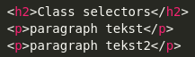
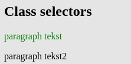

# Opdrachten CSS
 ## H1 Selectors and visual rules
 <br>

* ### Q1 Je kunt op 3 verschillende manieren CSS in je HTML inladen. Op welke 3 manieren kun je dat doen? Leg ook voor elke wijze uit wat het precies inhoud.

1. inline: je gebruikt het style attribute van het html element. Bijvoorbeeld: 
```
<h1 style="color: white;">Dit is een witte Titel</h1>
```
2. internal CSS: je zet de css-regels in het document zelf. Binnen een &lt;style> tag in de HEAD.

3. external CSS: je verwijst met een link in HEAD naar een extern CSS bestand. Voorbeeld:
```
<head>
  <link rel="stylesheet" href="styles.css">
</head>
```
<br>

* ### Q2 CSS pas je toe met een bepaalde syntax. Hoe ziet zo'n syntax eruit? Kun je ook uitleggen wat elk element uit de syntax betekent?

De syntax (een set regels) bevat de volgende elementen:
1. De selector: hiermee selecteer je het element of de elementen waarvan je de kenmerken wilt aanpassen.
    Je kunt onder andere selecteren op &lt;type>, class en id.
2. Property/Value pairs: hiermee zeg je welk kenmerk (Property) je wilt aanpassen met welke waarde (Value).
Voorbeeld:

```
h1 (type-selector) {
    color: (property) white(value);
}

.green-paragraph (class-selector) {
    color: green;
}

#para1 (id-selector) {
    color: red;
}
```
<br>

* ### Q3 Er zijn verschillende selectors, bijvoorbeeld;

* type selectors
* class selectors
* ID selectors
* descendant selectors

### Maak van de bovengenoemde selectors voorbeelden. Geef in je antwoord ook aan wat de voordelen zijn van elke selector.

zie Q2. Voorbeeld van een descendand selector:
```
div p {
  background-color: yellow;
  }
<!--  (Alle <p> elementen binnen <div> elementen worden hier geselecteerd) -->
```
<br>

De voordelen van:
* type selectors: alle elementen van dit type worden geselecteerd, snel een resultaat.
* class selectors: alle elementen met deze classname worden geselecteerd, hiermee kun je preciezer zijn.
* ID selectors: hiermee wordt één uniek element geselecteerd.
* descendant selectors: alle elementen van het laatsgenoemde type die binnen het eerst genoemde element staan worden geselecteerd.

<br>

* ### Q4 Maak een .html file en voeg de volgende code toe:


Maak het onderstaande na door gebruik te maken van selectors. De kleuren die hiervoor gebruikt zijn is green en darkblue.


<br>

[link naar antwoord CTRL+CLICK](https://htmlpreview.github.io/?https://github.com/TG-WD6/wd-6-repo-Verwoost/blob/main/01_Fundamentals/04_css/opdrachten/hfdstkEENopdrachtVIER.html)

<br>
<br>

* ### Q5 Maak een aparte html bestand en voeg de volgende code toe:




Maak het onderstaande na door gebruik te maken van selectors. De kleuren die hiervoor gebruikt zijn is green en black.



<br>

[link naar antwoord CTRL+CLICK](https://htmlpreview.github.io/?https://github.com/TG-WD6/wd-6-repo-Verwoost/blob/main/01_Fundamentals/04_css/opdrachten/hfdstkEENopdrachtVIJF.html)

<br>
<br>

* ### Q6 Verder heb je ook nog de volgende selectors:


* universal selector
* attribute selectors
* child selectors
* adjacent sibling selectors
* general sibling selectors

### Maak een .html file waar je alledrie in gebruikt
<br>

[link naar antwoord CTRL+CLICK](https://htmlpreview.github.io/?https://github.com/TG-WD6/wd-6-repo-Verwoost/blob/main/01_Fundamentals/04_css/opdrachten/hfdstkEENopdrachtZES.html)

<br>
<br>

* ### Q7 Je kan selectors ook op meerdere manieren combineren. Bijvoorbeeld:

* Een selector die alle elementen met type div EN class “opdracht” selecteert
* Meerdere selectors die hetzelfde stukje CSS gebruiken

### Maak een .html file waarin beide voorbeelden worden gebruikt
<br>

[link naar antwoord CTRL+CLICK](https://htmlpreview.github.io/?https://github.com/TG-WD6/wd-6-repo-Verwoost/blob/main/01_Fundamentals/04_css/opdrachten/hfdstkEENopdrachtZEVEN.html)
<br>
<br>

* ### Q8 Leg in eigen woorden uit wat met cascade en inheritance wordt bedoeld. Maak voorbeelden om je antwoord uit te leggen.

<br>

Cascade: kun je zien als een waterval waarbij het water dat het langst aan het vallen is de meeste impact heeft.
Met betrekking tot CSS zijn er drie regels waar je rekening mee moet houden: 

* volgorde (source order):      wanneer meerdere regels even specifiek en belangrijk zijn telt de onderste
* specicificiteit (specificity) wanneer meerdere regels even belangrijk zijn telt de meest specifieke
* belang (importance)           de meest belangrijke regel telt   

<br>
Voorbeeld 1: de h2 elementen zullen rood zijn omdat de laatste regel telt.
<br>

```
<style>
  h2{
    color: blue;
  }

  h2{
    color: red;
  }

```
<br>

Voorbeeld 2: Het eerste h2 element is rood. Het tweede h2 element is blauw omdat de .class selector meer specifiek is. Het derde element groen omdat deze een id attribute heeft. Een id selector is de meest specifieke selector.

<br>

```
<style> 

  h2{ 
    color: red;
  }

  .bluetitle{
    color: blue;
  }

  #greentitle{
    color: green;
  }

</style>
</head>

<html>
  <body>

    <h2>Title1</h2>

    <h2 class="bluetitle">Title2</h2>

    <h2 class="bluetitle" id="greentitle">Title3</h2>

```
<br>
<br>

Voorbeeld 3: In het volgende voorbeeld zal het h2 element rood zijn en geen border hebben omdat hoewel de id-selector het meest specifiek is, de regel "border: none !important;" in de class-selector de rest overtreft wat betreft belang.
<br>

```
  .greenNoBorder{
    color: green;
    border: none !important;
  }

  #redGreyBorder{
    color: red;
    border: 2px solid grey;
  }

</style>
</head>

<html>
  <body>

  <h2 class="greenNoBorder" id="redGreyBorder">Title</h2>

```

## H2 Het BOX-model

* ### Q1 Wat zijn de eigenschappen van block boxes en inline boxes?

<br>

Block neemt de gehele breedte van de container in beslag, inline boxes kunnen naast elkaar.

<br>

* ### Q2 Maak wat hieronder staat met paragraph en span tags.


<br>

[link naar het antwoord CTRL+CLICK](https://htmlpreview.github.io/?https://github.com/TG-WD6/wd-6-repo-Verwoost/blob/main/01_Fundamentals/04_css/opdrachten/hfdstkTWEEopdrachtTWEE.html)

<br>

* ### Q3 Wat gebeurt er als je een width en een height toevoegt aan de span tag ( &lt;span> ) van vorige opdracht?

Helemaal niets.

<br>

* ### Q4 Hieronder zie je een box-model:


Leg uit wat de volgende termen betekenen: content, padding, margin en border.

<br>

1. Content is de inhoud.
2. Padding is de ruimte tussen de inhoud en de border.
3. Border is de rand om de inhoud en de padding.
4. Margin is ruimte tussen de border en buiten de box.

<br>

* ### Q5 Als je ruimte wilt maken tussen de border en content, welke css property gebruik je dan? Maak een voorbeeld in je antwoord.

```
Antwoord: padding.
Voorbeeld: 

<p style= "padding: 2rem;"> Dit is een paragraaf </p>

```

<br>

* ### Q6 Als je ruimte wilt maken tussen de border en buiten de box, welke css property gebruik je dan? Maak een voorbeeld in je antwoord.

```
Antwoord: margin.
Voorbeeld:

<p style= "margin: 2rem;"> Dit is een paragraaf </p>

```

<br>

* ### Q7 Maak nu een blok met width: 100px, height: 100px, margin: 5px, padding 5px en border-width: 5px. Zie hieronder:


1. Hoe breed is de box? 120px

2. Hoe hoog is de box? 120px

3. Wat merk je op met width en height? alles behalve margin telt mee voor de breedte en hoogte. Dus als je width en height op 100px zet en de padding op 5px, dan is de totale hoogte 100px PLUS (2 x 5px) = 110px

<br>

[link naar het voorbeeld CTRL+CLICK](https://htmlpreview.github.io/?https://github.com/TG-WD6/wd-6-repo-Verwoost/blob/main/01_Fundamentals/04_css/opdrachten/hfdstkTWEEopdrachtZEVEN.html)

* ### Q8 Welke CSS property kun je gebruiken om ervoor te zorgen dat de waarde van width en height de totale breedte en hoogte is van het blok van de voorgaande opdracht?

box-sizing: border-box;

<br>
<br>

## H3 Display and Positioning

* ### Q1 De belangrijkste waardes van “position” zijn static, relative, absolute, fixed & sticky. Leg voor elke uit wat ze doen.

<br>

1. Static: Dit is de standaardwaarde. Het element blijft in de normale flow van het document.
2. Relative: Het element wordt relatief aan de initiele positie gepositioneerd en de ruimte die het element in zou nemen blijft bezet. Andere elementen blijven dus op hun plek.
3. Absolute: Het element wordt uit de normale flow getild en verhoudt zich tot de buitenkant van de container.
Andere elementen schuiven op alsof het element niet bestaat. 
4. Fixed:  Het element wordt uit de normale flow getild en verhoud zich tot de initiele positie in de viewport.
5. Sticky: Het element blijft in de normale flow en verhoud zich tot het dichtstbijzijnde scrolling element. Als je scrollt lijkt dit element vast-(geplakt) te zitten.

<br>

* ### Q2  to Q8

[link naar de antwoorden CTRL+CLICK](https://htmlpreview.github.io/?https://github.com/TG-WD6/wd-6-repo-Verwoost/blob/main/01_Fundamentals/04_css/opdrachten/hfdstkDRIE.html)

## H4 Pseudo Elements

* ### Q1 Er zijn 16 verschillende pseudo-elementen. Beschrijf ze alle 16 kort en maak voor elk een voorbeeld

1. **::after** als je iets wilt toevoegen na een element. Bijvoorbeeld een pijl na een link.
2. **::backdrop** als je een achtergrondkleur wilt toevoegen aan een element als het fullscreen wordt weergegeven.
3. **::before** als je iets wilt toevoegen vóór een element. Bijvoorbeeld een icon voor een listitem.
4. **::cue** als je de cijfers bij het afspelen van een video wilt aanpassen
6. **::first-letter** als je de eerste letter van de inhoud van een element wilt stylen. de IJ werkt niet.
5. **::cue-region** heeft ook iets te maken met de tekst die bij een video komt
7. **::first-line** als je de eerste regel van de inhoud van een element wilt stylen. toepassen bij block elementen en niet bij inline elementen.
8. **::file-selector-button** als je bij &lt;input type="file"> de knop: bestand kiezen wilt aanpassen.
9. **::grammar-error** als de browser een grammaticale fout detecteert.
10. **::marker** de bullets bij een listitem. Het pijltje bij een summary.
11. **::part** heeft iets met schaduw te maken, maar ik begrijp het niet helemaal.
12. **::placeholder** dit kun je beter niet aanpassen ivm leesbaarheid en accessibility.
13. **::selection** de door de gebruiker geselecteerde tekst stylen. Denk aan contrast en accessibility.
14. **::slotted** te ingewikkeld voor nu.
15. **::spelling-error** als de browser een spelfout detecteert.
16. **::target-text** als de browser scroll-to-text fragments ondersteunt dan kun je deze stylen.

[link naar de voorbeelden CTRL+CLICK](https://htmlpreview.github.io/?https://github.com/TG-WD6/wd-6-repo-Verwoost/blob/main/01_Fundamentals/04_css/opdrachten/hfdstkVIERopdrachtEEN.html)

<br>

* ### Q2 Hieronder vind je een voorbeeld van het gebruik van een pseudo-element. Kun jij dit namaken?


<br>

[link naar antwoord CTRL+CLICK](https://htmlpreview.github.io/?https://github.com/TG-WD6/wd-6-repo-Verwoost/blob/main/01_Fundamentals/04_css/opdrachten/hfdstkVIER.html)

<br>

* ### Q3 Hieronder vind je nog eens een voorbeeld van het gebruik van een pseudo-element ::before. Kun jij dit namaken? Gebruik een eigen afbeelding.


<br>

[link naar antwoord CTRL+CLICK](https://htmlpreview.github.io/?https://github.com/TG-WD6/wd-6-repo-Verwoost/blob/main/01_Fundamentals/04_css/opdrachten/hfdstkVIER.html)

<br>

* ### Q4 Hieronder vind je wederom een voorbeeld van het gebruik van een pseudo-element. Kun jij dit namaken?

<br>


<br>

[link naar antwoord CTRL+CLICK](https://htmlpreview.github.io/?https://github.com/TG-WD6/wd-6-repo-Verwoost/blob/main/01_Fundamentals/04_css/opdrachten/hfdstkVIER.html)

<br>

* ### Q5 De laatste opdracht vergt wat creativiteit. Zie het onderstaande voorbeeld en maak het na.


<br>

[link naar antwoord CTRL+CLICK](https://htmlpreview.github.io/?https://github.com/TG-WD6/wd-6-repo-Verwoost/blob/main/01_Fundamentals/04_css/opdrachten/hfdstkVIER.html)

<br>

## H5 Flexbox

<br>

[link naar antwoorden CTRL+CLICK](https://htmlpreview.github.io/?https://github.com/TG-WD6/wd-6-repo-Verwoost/blob/main/01_Fundamentals/04_css/opdrachten/flex_box.html)

## **Opdrachten**

<br>

### **Opdracht 1**

Zie het onderstaande voorbeeld en maak het na met flex. Gebruik **geen** width, height of line-height.


<br>

### **Opdracht 2**

Zie het onderstaande voorbeeld, de items staan nu anders uitgelijnd. Maak het na met flex. Gebruik **geen** width, height of line-height.


<br>

### **Opdracht 3**

Zie het onderstaande voorbeeld, een van de items is breder dan de rest. Maak het na met flex. Gebruik **geen** width, height of line-height.


<br>

### **Opdracht 4**

De property ‘justify-content’ is een property die door flex gebruikt wordt. Maak een voorbeeld dat gebruik maakt van de align-items property.

<br>

### **Opdracht 5**

De property ‘align-items’ is een property die door flex gebruikt wordt. Maak een voorbeeld dat gebruik maakt van de align-items property.

<br>

### **Opdracht 6**

Maak het onderstaande na met flexbox. Properties die je o.a dient te gebruiken zijn:

* display
* justify-content
* flex-direction


<br>

### **Opdracht 7**

Maak het onderstaande na met flexbox. Properties die je o.a dient te gebruiken zijn:

* display
* justify-content
* flex-direction
* align-items


<br>

### **Opdracht 8**

Zie het onderstaande voorbeeld en maak het na met flexbox.


<br>

# ** H5 CSS Grid**

### **Opdracht 1**

Bij CSS Grid wordt vaak gebruikgemaakt van een speciale lengte-eenheid: “**fr**”. Onderzoek wat deze doet en beschrijf het in je eigen woorden.

<br>

Fraction: is een breuk. De ruimte die je hebt gedeeld door het aantal rows of columns. 

<br>

### **Opdracht 2**

Via “grid-template-rows” en “grid-template-columns” kan je de maten van je Grid bepalen. Via “grid-row” en “grid-column” kan je vervolgens het begin + einde van een item aangeven in respectievelijk horizontale en verticale richting.

Gebruik deze properties en maak het volgende na:


<br>

### **Opdracht 3**

Je kan bij grid ook een speciale waarde gebruiken voor herhalende rijen / kolommen: **repeat()**. Onderzoek hoe deze werkt en herschrijf nu de vorige opdracht met een repeat() waarde.

<br>

### **Opdracht 4**

Een andere vergelijkbare speciale waarde is de **minmax()** functie. Onderzoek hoe deze werkt en verwerk het in je grid.

<br>

### **Opdracht 5**

Soms is de grootte van je grid item niet precies hetzelfde als de maat die je Grid gebruikt. Dan kan je een aantal properties gebruiken om dit grid item binnen de aangewezen ruimte te positioneren. Dit kan je bepalen voor het hele grid tegelijkertijd, of per item individueel - net zoals bij flexbox!

Geef je “article” divs een “height: 200px;” en “width: 600px;”. Positioneer ze vervolgens zoals onderstaand:


<br>

### **Opdracht 6**

Wat is het verschil tussen justify/align/place-items en justify/align/place-content?

<br>

### **Opdracht 7**

Je kan ook wat ruimte tussen je rijen / kolommen zetten met “grid-row-gap” / “grid-column-gap” of de shorthand “grid-gap”. Dit is vrij vergelijkbaar met padding / margin. Bij moderne browsers kan je “grid” uit de naam van deze CSS properties weglaten.

Geef je grid een gap van 10px.

<br>

### **Opdracht 8**

Tot zover heb je je grid ingedeeld met bepaalde maten en getallen gebruikt om het begin/einde van de rij/kolom aan te geven per item. Maar het kan ook anders!

Je kan namelijk ook bepaalde lijnen aangeven bij het indelen van je grid, en deze lijnen vervolgens als begin / eindpunt bepalen bij je items. Dit kan helpen met de overzichtelijkheid.

Geef je grid de waardes “grid-template-columns: [col-start] 300px [col-mid] 1fr [col-end];” en “grid-template-rows: [row-start] 1fr [row-mid] 1fr [row-end];”. Gebruik vervolgens **alleen** de namen van de lijnen om je grid-items in te delen.

<br>

### **Opdracht 9**

Je kan bij CSS Grid ook een “standaardmaat” voor rijen / kolommen definieren, mocht er een grid item “buiten” je gedefinieerde grid vallen. Als dat gebeurt wordt het een onderdeel van een **_implicit grid_**. Hoe groot dit implicit grid is qua maat kan je bepalen via **“grid-auto-columns”** en **“grid-auto-rows”**.

Vervang je “grid-template-rows” door “grid-auto-rows”. Maak een nieuwe “article” div met “grid-row-start: 5” om dit te testen.

Meer lezen over Implicit vs Explicit Grid? [Hier](https://css-tricks.com/difference-explicit-implicit-grids/) is een goed artikel.

<br>

### **Opdracht 10**

Tenslotte kan je ook bepaalde delen van je grid een naam geven. Dit doe je met de **“grid-template-areas”** property. Vervolgens kan je je grid items toewijzen aan een bepaald gebied met de **“grid-area”** property.

Gebruik grid-template-areas om je sidebar te benoemen. Gebruik vervolgens grid-area (en **geen** grid-column of grid-row!) om je sidebar de gepaste plek te geven.

<br>

# **Transitions**

CSS-transitions bieden een manier om de animatiesnelheid te regelen bij het wijzigen van CSS-properties. In plaats van het onmiddellijk wijzigen van de properties, kun je ervoor zorgen dat de wijzigingen in een property gedurende een bepaalde periode plaatsvinden. Als je bijvoorbeeld de kleur van een element verandert van wit naar zwart, dan is de verandering meestal onmiddellijk. Als CSS-transitions zijn toegepast, vinden er wijzigingen plaats met tijdsintervallen die een versnellingscurve volgen, die allemaal kunnen worden aangepast naar wens.

Animaties die een transitie tussen twee toestanden met zich meebrengen, worden vaak ‘implicit transitions’ genoemd, omdat de staat tussen de start- en eindstaat impliciet wordt gedefinieerd door de browser.


Met CSS-transitions kun je zelf beslissen welke properties jij wilt animeren (door ze expliciet te vermelden), wanneer de animatie zal starten (door een ‘delay’ in te stellen), hoe lang de transitie zal duren (door een ‘duration’ in te stellen) en hoe de transitie zal verlopen (door de ‘timing function’ te definiëren, bijv. ‘linear’ of ‘ease-in-out’).

Het is goed om te weten dat niet alle CSS-properties te animeren zijn. In de officiële documentatie is een lijst beschikbaar met een opsomming van de properties die je kunt animeren, oftewel, waar je transitions op kunt toepassen. Zie hier [de volledige lijst](https://developer.mozilla.org/en-US/docs/Web/CSS/CSS_animated_properties) van properties die je kunt animeren.

Wil je meer lezen over transitions? Bekijk de [officiële documentatie](https://developer.mozilla.org/en-US/docs/Web/CSS/CSS_Transitions/Using_CSS_transitions) en verdiep je verder in transitions en hoe het werkt.

<br>

## **Opdrachten**

<br>

### **Opdracht 1**

Zoek uit wat transitions zijn en beschrijf met eigen woorden wat het betekent.

<br>

Transitions zijn overgangen van de ene naar de andere waarde van een kenmerk

<br>

### **Opdracht 2**

Maak een simpele transition die de kleur van een tekst aanpast.

<br>

[link naar de antwoorden CTRL+CLICK](https://htmlpreview.github.io/?https://github.com/TG-WD6/wd-6-repo-Verwoost/blob/main/01_Fundamentals/04_css/opdrachten/transitions.html)

### **Opdracht 3**

Transitions kent verschillende transition-timing. Zie hieronder een voorbeeld. Maak het na.


<br>

### **Opdracht 4**

Je kunt op verschillende properties transitions aangeven. Zie hieronder een voorbeeld. Zoek uit op welke properties de transitions zitten en maak het ongeveer hetzelfde na.


<br>

### **Opdracht 5**

Hieronder zie je wederom een voorbeeld van een transition. Je kunt op verschillende properties transitions aangeven. Zoek uit op welke properties de transitions zitten en maak het na. Je eigen creativiteit gebruiken is uiteraard toegestaan.


<br>

### **Opdracht 6**

Zie de onderstaande card deck. Kun jij deze zelf namaken? Je mag uiteraard weer je eigen creativiteit erop los laten.


<br>

### **Opdracht 7 - extra opdracht (optioneel)**

Zie de onderstaande animatie en probeer deze na te maken. Hier is gebruik gemaakt van keyframe animatie.


<br>

# **Responsive web design**

Het liefst wil je dat je website zich automatisch aanpast naar het apparaat dat je gebruikt, of eigenlijk naar de grootte van het browserscherm op dat apparaat.

Je maakt je site responsive met media queries. Een media query is een stukje code in de CSS stylesheet van je website, dat informatie zoals de grootte van het browserscherm van de bezoeker opvraagt tijdens het laden van jouw website. Weet je site wat de grootte van het browserscherm is, dan laat je site de opgevraagde informatie zien op de manier waarop je dat hebt opgezet. Dit stel je in met specifieke CSS stijlregels voor de verschillende schermgroottes.

Een website die zich met behulp van media queries aanpast aan de grootte van het browserscherm waarop het getoond wordt, heet een **responsive website**.

De kleinere browserschermen worden voornamelijk op mobiele apparaten gebruikt, maar je kunt het responsive effect ook zien wanneer je het browserscherm op je desktop verkleint. De media queries kijken namelijk alleen maar naar de grootte het browserscherm, en niet naar de grootte van het scherm zelf. Bekijk hier de [officiële documentatie](https://developer.mozilla.org/en-US/docs/Web/CSS/Media_Queries/Using_media_queries) om meer te leren over media queries.


Media queries werken eigenlijk heel simpel. De media query die je gebruikt zoekt uit wat de grootte is van het browserscherm en past vervolgens de door jou gewenste CSS toe als desbetreffende schermgrootte wordt gevonden.

Hieronder zie je een media query staan die we stap voor stap gaan ontleden.


Wat hier eigenlijk staat is "Als het scherm wijder is dan 900 pixels dan moet de kleur van de tekst rood worden.

Het onderstaande plaatje laat nog eens goed zien hoe de media query is opgedeeld.


Hoe je media queries moet gebruiken om CSS-regels toe te passen op basis van schermgrootte en resolutie heb je hierboven kunnen zien, maar hoe bepaal je welke queries je moet instellen?

De punten waarop media queries worden ingesteld, worden ‘breakpoints’ genoemd. Breakpoints zijn de schermformaten waarop jouw webpagina niet correct meer wordt weergegeven. Als we bijvoorbeeld tablets willen targeten die in liggende stand staan, kunnen we de volgende breakpoint maken:

    @media only screen and (min-width: 768px) and (max-width: 1024px) and (orientation: landscape) {
      hier plaats je dan je gewenste CSS regels
    }

In het bovenstaande voorbeeld wordt een schermformaat gecreëerd ter grootte van een tablet in liggende modus en wordt ook de oriëntatie aangegeven.

Het instellen van breekpunten voor elk denkbaar apparaat zou echter ongelooflijk moeilijk zijn, omdat er veel apparaten zijn met verschillende vormen en maten. Daarnaast komen er elk jaar nieuwe toestellen uit met nieuwe schermformaten.

In plaats van breekpunten in te stellen op basis van specifieke apparaten, is het het beste om het formaat van de browser aan te passen om te zien waar de website van nature breekt op basis van de inhoud. De afmetingen waarop de lay-out ‘breekt’ oftewel, er vreemd uitziet, worden de breekpunten van jouw media query. Binnen die breekpunten kunnen we de CSS aanpassen om het formaat van de webpagina te wijzigen en te reorganiseren.

Door de afmetingen te observeren waarop een website van nature ‘breekt’, kun je mediaquery-breekpunten instellen die de best mogelijke gebruikerservaring geven bij desbetreffende specifieke project waar je mee bezig bent. Dit is veel beter dan dat je elk project dwingt om op een bepaalde schermgrootte te passen. Verschillende projecten hebben verschillende behoeften, en het maken van een responsief ontwerp zou niet anders moeten zijn.

Bekijk [deze lijst met breekpunten](https://s3.amazonaws.com/codecademy-content/courses/freelance-1/unit-5/screen-sizes.png) op basis van apparaat breedte. Gebruik het als referentie voor schermbreedtes om je website te testen om er zeker van te zijn dat deze er op verschillende apparaten goed uitziet.

<br>

## **Opdrachten**

Om de opdrachten uit te kunnen voeren heb je natuurlijk als eerste een webpage nodig die **niet** responsive is. Die hoef je voor het gemak niet helemaal zelf te maken. In deze git repository is al een "template.html" met bijgevoegde css en images onder css/opdrachten/responsive die je bij deze opdrachten dient te gebruiken.

<br>

### **Opdracht 1**

Schrijf onderaan je CSS bestand een media query voor een maximale breedte van 480px. Hierdoor kunnen we de breedte van het page-title element op kleinere schermen verkleinen.

Als het scherm minder dan 480px breed is, geeft je de .page-title class een breedte van 270px. Hierdoor wordt het page-title element duidelijker weergegeven op kleine schermen. Test je code door het formaat van de browser aan te passen in element inspection.

<br>

### **Opdracht 2**

Laten we de gallery afbeeldingen groter laten lijken als de schermgrootte klein tot middelgroot is. Schrijf een media query voor schermformaten met een bereik tussen 320px en 480px. Gebruik min-breedte en max-breedte om het bereik te definiëren.

Selecteer in de media query de thumbnails van de gallery met .gallery-item .thumbnail en geef ze een breedte van 95%. Als het goed is zul je zien dat de gallery afbeeldingen breder lijken wanneer de schermgrootte tussen 320 en 480 pixels breed is.

<br>

### **Opdracht 3**

Schrijf een media query om een logo van een hogere kwaliteit te tonen als de bezoeker naar de Amazing Space website kijkt op een scherm met hoge resolutie. Een beeldscherm met hoge resolutie heeft mogelijk een min-resolutie van 150 dpi. Het hogere kwaliteit logo is het andere bijgevoegde plaatje.

Als je je pagina opent op een scherm met een resolutie groter dan 150 dpi, zul je de verandering van het logo zien. Als dit niet het geval is (omdat je een kleinere resolutie hebt), kun je in de media query de min-resolution op een lagere waarde zetten om de verandering te zien.

<br>

### **Opdracht 4**

De tekst van de website moet groter zijn voor gebruikers met kleine schermen met een lage resolutie. Schrijf een media query die van toepassing is wanneer de maximale resolutie 150 dpi is en het scherm een ​​maximale breedte heeft van 480px.

Maak binnen de media query de font-size van het page-description element 20px.

<br>

### **Opdracht 5**

Ga nog eens terug naar de eerste media query waarin je je richtte op schermen met een minimale breedte van 320 px en een maximale breedte van 480 px. Laten we ook het logo en de tekst verticaal verschijnen als het scherm in ‘portrait’ oriëntatie staat.

Voeg nog een mediafunctie toe aan de regel door een komma te gebruiken om regels te scheiden. De tweede mediafunctie moet controleren of de oriëntatie van het scherm daadwerkelijk ‘portrait’ is.

<br>

### **Opdracht 6**

De laatste breakpoint waar we rekening mee willen houden is een tablet in liggende stand (landscape). De Amazing Space website zou het formaat moeten veranderen om de gallery afbeeldingen aan de rechterkant weer te geven, terwijl het logo en de beschrijving aan de linkerkant staan. Schrijf een media query die aan de volgende vereisten voldoet:

* Het scherm heeft een minimale breedte van 768px;
* Het scherm heeft een maximale breedte van 1024px;
* Het scherm heeft als oriëntatie ‘landscape’.

Deze query zorgt ervoor dat de paginatitel en beschrijving links van de gallery afbeeldingen komen te zweven. Pas het formaat van de browser aan om deze veranderingen op verschillende schermbreedtes te observeren.

**Test nu je project op responsiveness door het op verschillende schermen te tonen om te kijken of jouw breakpoints werken. Je kunt dit doen door ‘toggle device toolbar’ te gebruiken, dat ingebouwd is in je browser.**
