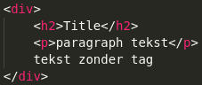
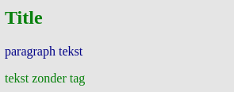
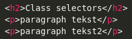
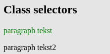

# Opdrachten CSS
 ## H1 Selectors and visual rules
 <br>

* ### Q1 Je kunt op 3 verschillende manieren CSS in je HTML inladen. Op welke 3 manieren kun je dat doen? Leg ook voor elke wijze uit wat het precies inhoud.

1. inline: je gebruikt het style attribute van het html element. Bijvoorbeeld: 
```
<h1 style="color: white;">Dit is een witte Titel</h1>
```
2. internal CSS: je zet de css-regels in het document zelf. Binnen een &lt;style> tag in de HEAD.

3. external CSS: je verwijst met een link in HEAD naar een extern CSS bestand. Voorbeeld:
```
<head>
  <link rel="stylesheet" href="styles.css">
</head>
```
<br>

* ### Q2 CSS pas je toe met een bepaalde syntax. Hoe ziet zo'n syntax eruit? Kun je ook uitleggen wat elk element uit de syntax betekent?

De syntax (een set regels) bevat de volgende elementen:
1. De selector: hiermee selecteer je het element of de elementen waarvan je de kenmerken wilt aanpassen.
    Je kunt onder andere selecteren op &lt;type>, class en id.
2. Property/Value pairs: hiermee zeg je welk kenmerk (Property) je wilt aanpassen met welke waarde (Value).
Voorbeeld:

```
h1 (type-selector) {
    color: (property) white(value);
}

.green-paragraph (class-selector) {
    color: green;
}

#para1 (id-selector) {
    color: red;
}
```
<br>

* ### Q3 Er zijn verschillende selectors, bijvoorbeeld;

* type selectors
* class selectors
* ID selectors
* descendant selectors

### Maak van de bovengenoemde selectors voorbeelden. Geef in je antwoord ook aan wat de voordelen zijn van elke selector.

zie Q2. Voorbeeld van een descendand selector:
```
div p {
  background-color: yellow;
  }
<!--  (Alle <p> elementen binnen <div> elementen worden hier geselecteerd) -->
```
<br>

De voordelen van:
* type selectors: alle elementen van dit type worden geselecteerd, snel een resultaat.
* class selectors: alle elementen met deze classname worden geselecteerd, hiermee kun je preciezer zijn.
* ID selectors: hiermee wordt één uniek element geselecteerd.
* descendant selectors: alle elementen van het laatsgenoemde type die binnen het eerst genoemde element staan worden geselecteerd.

<br>

* ### Q4 Maak een .html file en voeg de volgende code toe:



Maak het onderstaande na door gebruik te maken van selectors. De kleuren die hiervoor gebruikt zijn is green en darkblue.



<br>

[link naar antwoord](hfdstkEENopdrachtVIER.html)

<br>
<br>

* ### Q5 Maak een aparte html bestand en voeg de volgende code toe:




Maak het onderstaande na door gebruik te maken van selectors. De kleuren die hiervoor gebruikt zijn is green en black.



<br>

[link naar antwoord](hfdstkEENopdrachtVIJF.html)

<br>
<br>

* ### Q6 Verder heb je ook nog de volgende selectors:


* universal selector
* attribute selectors
* child selectors
* adjacent sibling selectors
* general sibling selectors

### Maak een .html file waar je alledrie in gebruikt
<br>

[link naar antwoord](hfdstkEENopdrachtZes.html)

<br>
<br>

* ### Q7 Je kan selectors ook op meerdere manieren combineren. Bijvoorbeeld:

* Een selector die alle elementen met type div EN class “opdracht” selecteert
* Meerdere selectors die hetzelfde stukje CSS gebruiken

### Maak een .html file waarin beide voorbeelden worden gebruikt
