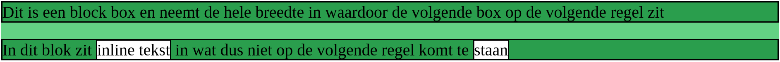
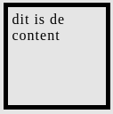

# Opdrachten CSS
 ## H1 Selectors and visual rules
 <br>

* ### Q1 Je kunt op 3 verschillende manieren CSS in je HTML inladen. Op welke 3 manieren kun je dat doen? Leg ook voor elke wijze uit wat het precies inhoud.

1. inline: je gebruikt het style attribute van het html element. Bijvoorbeeld: 
```
<h1 style="color: white;">Dit is een witte Titel</h1>
```
2. internal CSS: je zet de css-regels in het document zelf. Binnen een &lt;style> tag in de HEAD.

3. external CSS: je verwijst met een link in HEAD naar een extern CSS bestand. Voorbeeld:
```
<head>
  <link rel="stylesheet" href="styles.css">
</head>
```
<br>

* ### Q2 CSS pas je toe met een bepaalde syntax. Hoe ziet zo'n syntax eruit? Kun je ook uitleggen wat elk element uit de syntax betekent?

De syntax (een set regels) bevat de volgende elementen:
1. De selector: hiermee selecteer je het element of de elementen waarvan je de kenmerken wilt aanpassen.
    Je kunt onder andere selecteren op &lt;type>, class en id.
2. Property/Value pairs: hiermee zeg je welk kenmerk (Property) je wilt aanpassen met welke waarde (Value).
Voorbeeld:

```
h1 (type-selector) {
    color: (property) white(value);
}

.green-paragraph (class-selector) {
    color: green;
}

#para1 (id-selector) {
    color: red;
}
```
<br>

* ### Q3 Er zijn verschillende selectors, bijvoorbeeld;

* type selectors
* class selectors
* ID selectors
* descendant selectors

### Maak van de bovengenoemde selectors voorbeelden. Geef in je antwoord ook aan wat de voordelen zijn van elke selector.

zie Q2. Voorbeeld van een descendand selector:
```
div p {
  background-color: yellow;
  }
<!--  (Alle <p> elementen binnen <div> elementen worden hier geselecteerd) -->
```
<br>

De voordelen van:
* type selectors: alle elementen van dit type worden geselecteerd, snel een resultaat.
* class selectors: alle elementen met deze classname worden geselecteerd, hiermee kun je preciezer zijn.
* ID selectors: hiermee wordt één uniek element geselecteerd.
* descendant selectors: alle elementen van het laatsgenoemde type die binnen het eerst genoemde element staan worden geselecteerd.

<br>

* ### Q4 Maak een .html file en voeg de volgende code toe:


Maak het onderstaande na door gebruik te maken van selectors. De kleuren die hiervoor gebruikt zijn is green en darkblue.


<br>

[link naar antwoord](hfdstkEENopdrachtVIER.html)

<br>
<br>

* ### Q5 Maak een aparte html bestand en voeg de volgende code toe:


Maak het onderstaande na door gebruik te maken van selectors. De kleuren die hiervoor gebruikt zijn is green en black.


<br>

[link naar antwoord](hfdstkEENopdrachtVIJF.html)

<br>
<br>

* ### Q6 Verder heb je ook nog de volgende selectors:


* universal selector
* attribute selectors
* child selectors
* adjacent sibling selectors
* general sibling selectors

### Maak een .html file waar je alledrie in gebruikt
<br>

[link naar antwoord](hfdstkEENopdrachtZes.html)

<br>
<br>

* ### Q7 Je kan selectors ook op meerdere manieren combineren. Bijvoorbeeld:

* Een selector die alle elementen met type div EN class “opdracht” selecteert
* Meerdere selectors die hetzelfde stukje CSS gebruiken

### Maak een .html file waarin beide voorbeelden worden gebruikt
<br>

[link naar antwoord](hfdstkEENopdrachtZEVEN.html)
<br>
<br>

* ### Q8 Leg in eigen woorden uit wat met cascade en inheritance wordt bedoeld. Maak voorbeelden om je antwoord uit te leggen.

<br>

Cascade: kun je zien als een waterval waarbij het water dat het langst aan het vallen is de meeste impact heeft.
Met betrekking tot CSS zijn er drie regels waar je rekening mee moet houden: 

* volgorde (source order):      wanneer meerdere regels even specifiek en belangrijk zijn telt de onderste
* specicificiteit (specificity) wanneer meerdere regels even belangrijk zijn telt de meest specifieke
* belang (importance)           de meest belangrijke regel telt   

<br>
Voorbeeld 1: de h2 elementen zullen rood zijn omdat de laatste regel telt.
<br>

```
<style>
  h2{
    color: blue;
  }

  h2{
    color: red;
  }

```
<br>

Voorbeeld 2: Het eerste h2 element is rood. Het tweede h2 element is blauw omdat de .class selector meer specifiek is. Het derde element groen omdat deze een id attribute heeft. Een id selector is de meest specifieke selector.

<br>

```
<style> 

  h2{ 
    color: red;
  }

  .bluetitle{
    color: blue;
  }

  #greentitle{
    color: green;
  }

</style>
</head>

<html>
  <body>

    <h2>Title1</h2>

    <h2 class="bluetitle">Title2</h2>

    <h2 class="bluetitle" id="greentitle">Title3</h2>

```
<br>
<br>

Voorbeeld 3: In het volgende voorbeeld zal het h2 element rood zijn en geen border hebben omdat hoewel de id-selector het meest specifiek is, de regel "border: none !important;" in de class-selector de rest overtreft wat betreft belang.
<br>

```
  .greenNoBorder{
    color: green;
    border: none !important;
  }

  #redGreyBorder{
    color: red;
    border: 2px solid grey;
  }

</style>
</head>

<html>
  <body>

  <h2 class="greenNoBorder" id="redGreyBorder">Title</h2>

```

## H2 Het BOX-model

* ### Q1 Wat zijn de eigenschappen van block boxes en inline boxes?

<br>

Block neemt de gehele breedte van de container in beslag, inline boxes kunnen naast elkaar.

<br>

* ### Q2 Maak wat hieronder staat met paragraph en span tags.



<br>

[link naar het antwoord](hfdstkTWEEopdrachtTWEE.html)

<br>

* ### Q3 Wat gebeurt er als je een width en een height toevoegt aan de span tag ( &lt;span> ) van vorige opdracht?

Helemaal niets.

<br>

* ### Q4 Hieronder zie je een box-model:


Leg uit wat de volgende termen betekenen: content, padding, margin en border.

<br>

1. Content is de inhoud.
2. Padding is de ruimte tussen de inhoud en de border.
3. Border is de rand om de inhoud en de padding.
4. Margin is ruimte tussen de border en buiten de box.

<br>

* ### Q5 Als je ruimte wilt maken tussen de border en content, welke css property gebruik je dan? Maak een voorbeeld in je antwoord.

```
Antwoord: padding.
Voorbeeld: 

<p style= "padding: 2rem;"> Dit is een paragraaf </p>

```

<br>

* ### Q6 Als je ruimte wilt maken tussen de border en buiten de box, welke css property gebruik je dan? Maak een voorbeeld in je antwoord.

```
Antwoord: margin.
Voorbeeld:

<p style= "margin: 2rem;"> Dit is een paragraaf </p>

```

<br>

* ### Q7 Maak nu een blok met width: 100px, height: 100px, margin: 5px, padding 5px en border-width: 5px. Zie hieronder:



1. Hoe breed is de box? 120px

2. Hoe hoog is de box? 120px

3. Wat merk je op met width en height? alles behalve margin telt mee voor de breedte en hoogte. Dus als je width en height op 100px zet en de padding op 5px, dan is de totale hoogte 100px PLUS (2 x 5px) = 110px

<br>

[link naar het voorbeeld](hfdstkTWEEopdrachtZEVEN.html)

* ### Q8 Welke CSS property kun je gebruiken om ervoor te zorgen dat de waarde van width en height de totale breedte en hoogte is van het blok van de voorgaande opdracht?

box-sizing: border-box;

<br>
<br>


