# Variables & Datatypes - Opdrachten


### **Opdracht 1.1:**

We onderzoeken het verschil tussen var, let en const. Gegeven zijn een aantal voorbeelden - schrijf eerst je verwachtingen op voordat je ze zelf nabootst. Kijk vervolgens wat er bij jou in de console gelogd wordt - is dat wat je verwachtte? Zo nee, deel het dan aan het einde van de dag met je groep.

a) resulteert in een error: je kunt een let maar een keer in hetzelfde blok een waarde geven

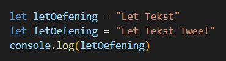

b) geeft de laatste waarde 

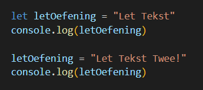

c) een const is read-only dus je kunt deze geen nieuwe waarde toekennen

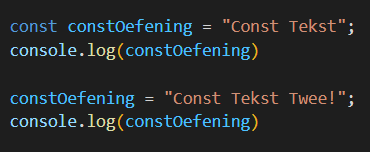

d) de var variabele kun je wijzigen

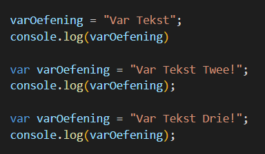


### **Opdracht 1.2:**

We onderzoeken de verschillende datatypes.

Gegeven de volgende code:


1. Wat zie je in de console? Was dat wat je verwachtte?
     **String** 
2. Vervang bij het voorbeeld “Number” door de volgenden:
    * true   &nbsp;  &nbsp;          **boolean**
    * false    &nbsp; &nbsp;          **boolean**
    * undefined (als je ‘= “Number”’ in zijn geheel weghaalt doet dat hetzelfde)
    * 22       &nbsp; &nbsp;           **number**
    * 22n &nbsp; &nbsp;   **bigint**
    * Symbol() &nbsp; &nbsp;  **function**
    * null &nbsp; &nbsp;   **object**
    * {} &nbsp; &nbsp;  **object with a value of [Object Object]**
    * new Object(); &nbsp; &nbsp;  **object with a value of [Object Object]**
    * function calculateSomething() {} &nbsp; &nbsp;   **function**


### **Opdracht 1.3:**

Gegeven de volgende code:

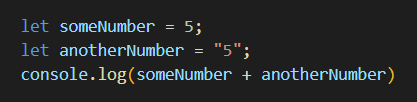

1. Wat komt hier uit? &nbsp; &nbsp;    **55**
2. Wat komt er uit als je van beiden een number maakt? &nbsp; &nbsp;  **10**
3. Wat komt er uit als je de + vervangt door:
    * "==" &nbsp; &nbsp;   **true**
    * "===" &nbsp; &nbsp;   **false**
    * "!=" &nbsp; &nbsp;   **false**
    * "!==" &nbsp; &nbsp;   **true**


### **Opdracht 1.4:**

We gaan operators wat nader onderzoeken, en ermee experimenteren.

1. Wat komt er uit het volgende? &nbsp; &nbsp;   **2 en 2**

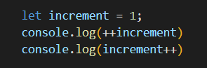

2. Wat komt er uit als je de console.log() hierboven omdraait? &nbsp; &nbsp;   **1 en 3**
3. Wat komt er uit het volgende? &nbsp; &nbsp;   **4 en 2.4**

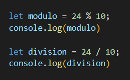

4. Wat komt er uit het volgende? (spaties toegevoegd voor helderheid) &nbsp; &nbsp;  **false want niet undefined of null**

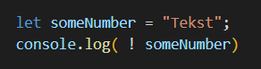

5. Wat komt er uit bovenstaand als je de waarde van someNumber verandert in:
    * 5 &nbsp; &nbsp;   **false**
    * Boolean &nbsp; &nbsp;   **false**
    * false &nbsp; &nbsp;  **true**
    * “false” &nbsp; &nbsp;  **false**
    * true &nbsp; &nbsp;  **false**
    * “true” &nbsp; &nbsp;  **false**
    * null &nbsp; &nbsp;  **true**
    * undefined &nbsp; &nbsp;  **true**
6. Zoek op of experimenteer wat "+=" doet. Werkt deze ook met Strings? Weet je hoe je deze anders kan schrijven?
    **neemt de waarde en voegt daar iets aan toe. x = (x+y) is hetzelfde als x += y.**
7. Doe hetzelfde voor "-=", "*=", "/=", "%=" en "**=".
    ``` x= (x-y)  is hetzelfde als x-=y
        x= (x*y)  is hetzelfde als x*=y
        x= (x/y)  is hetzelfde als x/=y
        x= (x%y)  is hetzelfde als x%=y  modulo: de 'blijft over' uit een breuk. Bijvoorbeeld 22/7 = 3(*7= 21), blijft over 1   
        
        x = 22;
        y = 7;

        x%=y 

        nu x=1 

        x= x**y is hetzelfde als x**=y  machtsverheffen x=2 y=3  x= 2**3  dus(x=8)

    ```

<br>

# String Methods - Opdrachten


### **Opdracht 2.1:**

Gegeven de volgende String:

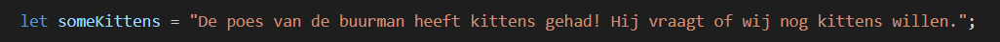

1. Splits de String met een string method op in 2 aparte zinnen. Stop beiden in een aparte variabele.
2. Zo’n geweldig nieuws verdient upper case. Zet someKittens om naar hoofdletters.
3. Geef de eerste en laatste index van het woord “kittens” in de variabele someKittens.
4. Gebruik charAt() op beiden. Welk teken krijg je terug?
```
let someKittens = "De poes van de buurman heeft kittens gehad! Hij vraag of wij nog kittens willen.";
    let firstStr = someKittens.slice(0,43);
    let secondStr = someKittens.slice(44);

    let upperStr = someKittens.toUpperCase();
    firstChar = someKittens.charAt(29);
    secondChar = someKittens.charAt(35);

    K en S
```   


### **Opdracht 2.2:**

substring() en slice() lijken erg op elkaar. We onderzoeken de verschillen. Test dit met een eigen string, of gebruik het vorige voorbeeld.

substring() en slice() kunnen 2 waardes meegegeven worden - een index waar de nieuwe waarde begint en een index waar deze moet eindigen.

1. Wat doet substring() als het eerste getal hoger is dan het tweede getal? &nbsp; &nbsp;   **Draait ze om**
2. Wat doet slice() als het eerste getal hoger is dan het tweede getal? &nbsp; &nbsp;   **Geeft een leeg resultaat**

Deze waardes hoeven niet per se positief te zijn - je kan ook negatieve getallen meegeven.

3. Wat doet substring() bij negatieve waardes? &nbsp; &nbsp;  **behandelt ze als 0**
4. Wat doet slice() bij negatieve waardes? &nbsp; &nbsp;  **telt vanaf het einde van de string terug**


### **Opdracht 2.3:**

Gegeven het volgende voorbeeld:

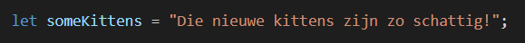

Gebruik split() om alle woorden apart in een Array te zetten.

```
   let splitArray = someKittens.split(' ');
    console.log(splitArray[4]);

    laat het vierde woord zien

```    

# Conditions - Opdrachten


### **Opdracht 3.1:**

Conditions werken erg vaak met operators. Om goed met conditions te kunnen werken, moet je operators echt goed begrijpen. Daarom onderzoeken we ze hier nogmaals:

1. Wat is het verschil tussen == en ===?  == vergelijkt de waarde  === vergelijkt de waarde en data type
2. Wat is het verschil tussen > en >=? En tussen &lt; en &lt;=?  groter dan en gelijk aan of groter dan. kleiner dan en gelijk aan of kleiner dan 

Soms controleert een conditie meerdere dingen tegelijkertijd. Dit doet met de hulp van **_Logical Operators_**:

* &&		EN
* ||		OF
* !		    NIET

Soms worden deze in combinatie gebruikt. Gegeven volgende code:

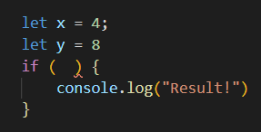

3. Schrijf de If conditie zo, dat je alleen “Result!”  ziet als x==4 en y==8
```
if(x==4 && y==8)
```

4. Schrijf het nu zo dat je alleen “Result!” ziet als x==4 OF y==8
```
if(x==4 || y==8)
```

5. Zet nu de console.log(“Results”) in een Else { } na de If. Kan je de conditie omdraaien zodat je alsnog “Results!” te zien krijgt?

```
if(!x==4 || !y==8){
    console.log("Not result");
}else{
    console.log("Result!");
}
```
6. Kan je het vorige antwoord ook geven zonder || te gebruiken?

Schrijf voor de volgende opdrachten 1 If/Else die 1 variabele waarde controleert, en zorg voor het volgende:

7. Log het in je console als de waarde groter dan 5 EN kleiner dan 10 is.
8. Zo niet, log dan in je console als de waarde 11 of groter EN 20 of kleiner is.
9. Zo niet, log dan in je console als de waarde 21 of 23 is.
10. Zo niet, log dan in je console als de waarde kleiner dan 35 OF tussen de 40 en 45 is.

```
if (someNumber>5 && someNumber<10 ) {
    console.log("tussen 5 en 10");
} else if (someNumber>11 && someNumber<=20 ) {
    console.log(" tussen 11 en 20"); 
    
}else if (someNumber==21 || someNumber==23 ) {
    console.log(" is 21 of 23"); 
    
}else if (someNumber<35 || (someNumber>40 && someNumber<45) ) {
    console.log(" kleiner dan 35 of tussen 40 en 45"); 
    
}

```

11. Test of je bij alle uitkomsten kan komen. Verandert er iets als je alle If/Else omzet in aparte If blokken?
     Ja, je voldoet meerdere keren aan de voorwaarden als de if blokken apart staan.


### **Opdracht 3.2:**

We oefenen nog wat extra met grotere If/Else blokken, Switch/case en Ternary Operators.

1. Schrijf een If/Else blok die een eigen variabele controleert:
    * Gelijk aan 3?
    * Groter dan 4?
    * Groter dan 11?
    * Kleiner dan 3?
2. Test je variabele met 2, 3, 4, 5 en 20. Gebeurt er iets onverwachts?
   Alles groter dan 4 wordt niet meer verder gecheckt
3. Schrijf een If/Else die een variabele op numerieke waarde controleert, en de passende maand in je console logt.
    * Januari
    * Februari
    * Maart
    * April
    * Mei
    * Juni
    * Juli
    * Augustus
    * September
    * October
    * November
    * December

	Andere getallen loggen (“Geen geldige maand!”).

4. Bouw nu opdracht C met een Switch/case.

```
 if (x == 1) {
        textbox.innerHTML = "januari";
    } else if (x == 2) {
        textbox.innerHTML = "februari";
    } else if (x == 3) {
        textbox.innerHTML = "maart";
    } else if (x == 4) {
        textbox.innerHTML = "april";
    } else {
        textbox.innerHTML = "geen geldig nummer!"
    }

    switch (x) {
        case '1':
            textbox.innerHTML = "januari";
            break;

        case '2':
            textbox.innerHTML = "februari";
            break;

        case '3':
            textbox.innerHTML = "maart";
            break;

        case '4':
            textbox.innerHTML = "april";
            break;

        default:
            textbox.innerHTML = "geen geldige input"
            break;
    }

```

Gegeven de volgende code:

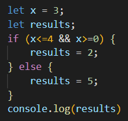

5. Herschrijf dit als een Ternary Operator.
```
x>=0 && x<=4 ? textbox.innerHTML = "waarde 0-4" : textbox.innerHTML = "waarde buiten 0-4";

```

### **Opdracht 4.1:**

We gaan functies oefenen door bij het begin te beginnen:

1. Maak een button en verbind er een functie aan. Zorg ervoor dat de functie in de console “Hello World” logt.
2. Maak een input element en geef het een bepaald ID. Sla dat ID op in een variabele via document.GetElementByID().
3. Maak een functie die een parameter in de console logt. Geef je input element vervolgens een _onchange_ attribuut die deze functie aanroept. Natuurlijk wil deze functie ook een parameter gebruiken - gebruik hiervoor de ID variabele uit de vorige vraag. Test het vervolgens door wat bij je input in te typen.
4. Geef je functie een return waarde, bijvoorbeeld de parameter * 2. Maak vervolgens een nieuwe variabele “result”. Roep je functie op met een getal als parameter en wijs de return waarde toe aan “result”. Log de variabele daarna in je console.

[link naar de voorbeelden CTRL+CLICK](https://htmlpreview.github.io/?https://github.com/TG-WD6/wd-6-repo-Verwoost/blob/main/02_Programming/Javascript/01_basics_opdrachten/index.html)

<br>

### **Opdracht 4.2**

We gaan een paar veelgebruikte DOM methods onderzoeken. Je bent inmiddels bekend met document.GetElementById(). Veel andere DOM methods geven Arrays terug - je hebt het inmiddels al vaker gelezen maar hoe je die verwerkt gaan we later nog leren :)

1. Onderzoek de volgende DOM methodes en gebruik ze in een voorbeeld:
    * document.getElementsByClassName **returns array met alle elementen met deze classname**
    * document.getElementsByTagName &nbsp; &nbsp;  **returns array met alle elementen van dit type**
    * document.querySelector   &nbsp; &nbsp; &nbsp; &nbsp;       **returns het eerste element dat aan de query voldoet**
    * document.querySelectorAll    &nbsp; &nbsp; &nbsp; &nbsp;    **returns array met alle elementen die aan de query voldoen**
    * element.innerHTML      &nbsp; &nbsp; &nbsp; &nbsp;          **returns of sets de inhoud van het element**
    * element.innerText         &nbsp; &nbsp; &nbsp; &nbsp;       **returns of sets de text in een element**
2. Bij opdracht 4.1c heb je een input als parameter meegegeven. Roep die functie nu aan met een _oninput_ ipv _onchange_, en console.log() de parameter.value ipv de parameter. Zie je de verschillen als je nu wat intypt?

<br>

[link naar de voorbeelden CTRL+CLICK](https://htmlpreview.github.io/?https://github.com/TG-WD6/wd-6-repo-Verwoost/blob/main/02_Programming/Javascript/01_basics_opdrachten/index.html)


### **Opdracht 4.3:**

Eerder heb je kennis gemaakt met het String object en de built-in String Methods. Nu gaan we kennismaken met nog zo een - het Math object. Het Math object heeft namelijk ook methods die bij functies erg veel gebruikt worden:

1. Maak een functie randomNumber() en verbindt die aan een button. Zorg dat de functie Math.random() in de console logt. Wat merk je op als je deze meerdere keren gebruikt?

Math.random() geeft dus een getal 0 >= x &lt; 1 terug - het kan wel 0 zijn, maar nooit 1. Als je die laat afronden met Math.round(), zal het vaker afronden naar beneden dan naar boven.

Als je een willekeurig getal wil tonen, moet je Math.floor() gebruiken op Math.random(). Als je dit zo doet, krijg je altijd 0 terug.

2. Verander je functie nu dat hij een parameter x gebruikt, en zorg dat hij het volgende in je console logt: Math.floor(Math.random() * x). Test nu je functie met verschillende waardes voor x. Valt iets je op?

Als je meer wil inlezen over het Math object, kan je dat doen via [w3schools](https://www.w3schools.com/js/js_math.asp) of [MDN](https://developer.mozilla.org/en-US/docs/Web/JavaScript/Reference/Global_Objects/Math).

3. Er zijn nog 2 belangrijke Math methods die handig zijn om te kennen. Onderzoek wat Math.min() en Math.max() doen. Kan je van beide al een voorbeeld geven?

Respectievelijk de laagste en de hoogste waarde uit een array van getallen.

<br>

### **Opdracht 4.4:**

We eindigen deze oefeningen met een lastige:

1. Schrijf een functie waar je een naam aan mee kan geven. Laat de naam vergelijken met de namen van mensen in je groepje. Wanneer je functie de naam wel/niet herkent moet dat als boodschap teruggegeven worden.
2. Schrijf een 2e functie die de eerste functie aanroept, en vervolgens de teruggegeven boodschap in een div element op je pagina toont. Denk aan de DOM methods!
3. Schrijf nu het bovenstaande nogmaals, maar gebruik dit keer Arrow Functions. Als het niet overal lukt is dat niet erg!

<br>

[link naar de voorbeelden CTRL+CLICK](https://htmlpreview.github.io/?https://github.com/TG-WD6/wd-6-repo-Verwoost/blob/main/02_Programming/Javascript/01_basics_opdrachten/index.html)

